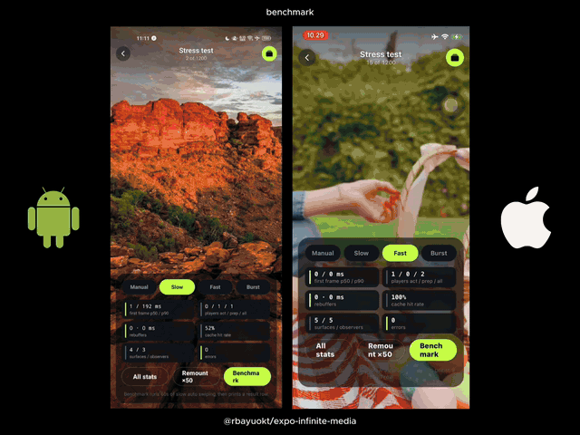
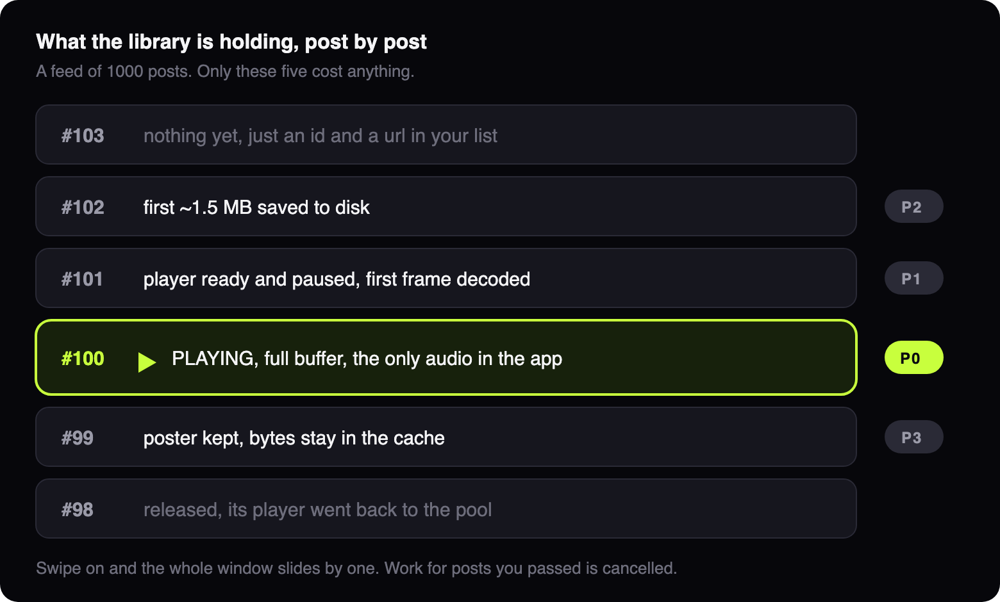
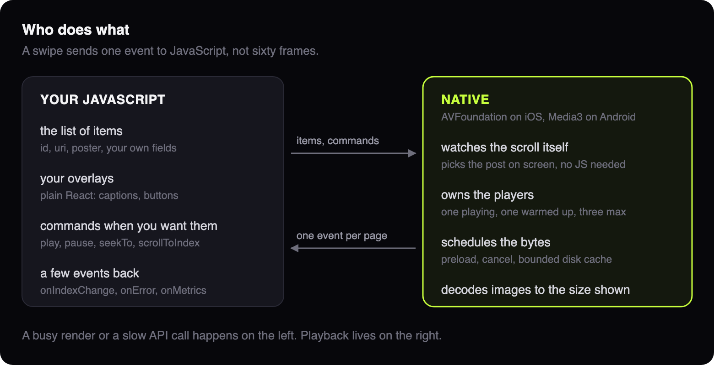
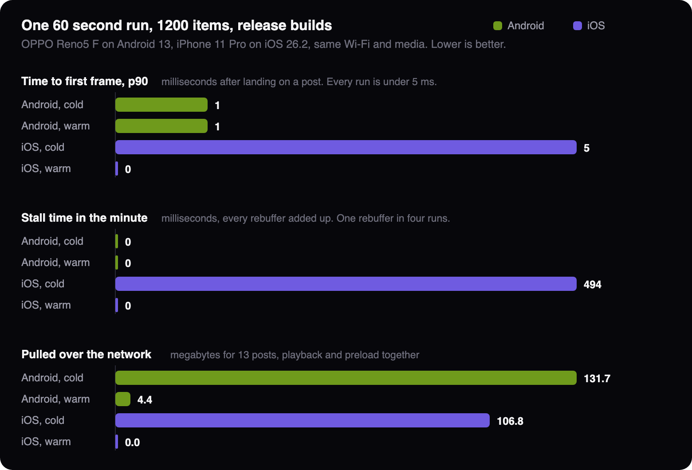

<p align="center">
  
</p>

# expo-infinite-media

<p align="center">
  
</p>

A native paged media feed for Expo and React Native CLI apps. Videos and photos in one
list, swiped a post at a time, vertical by default or horizontal with one prop. The feed
fills whatever space you give it, the media crops or letterboxes inside the page, and every
pixel on top of it is your own React.

Playback is handled in native code: AVFoundation on iOS, Media3 on Android. It owns the
players, works out what is on screen, prepares the next post and manages the cache. Your JS
thread is not in that path, so a slow render or a slow API call cannot stall a video.

What that means when you use it:

- The next video is prepared before you get there, so a swipe lands on a frame, not on black.
- One video plays at a time, and only that one has audio.
- Downloads for posts you scrolled past stop, instead of finishing in the background.
- The disk cache has a budget and stays under it.
- Three players serve a list of any length.

In an Expo app:

```bash
npx expo install @rbayuokt/expo-infinite-media
npx expo prebuild
```

It needs a development build, because Expo Go doesn't ship the native module. You don't
need a config plugin. Android gets `INTERNET` and `ACCESS_NETWORK_STATE` from the
library's manifest, and iOS needs no permissions.

In a React Native CLI app, add Expo modules first, then the package and the pods. Nothing
else about your project has to change, and there is no Expo runtime to adopt:

```bash
npx install-expo-modules@latest
npm install @rbayuokt/expo-infinite-media
npx pod-install
```

The `scrubber` prop is the one part with extra requirements, `react-native-reanimated`
and `react-native-gesture-handler`. Both are optional: without them the rest of the
library works and the scrubber is skipped with a warning.

|              | Minimum                                              |
| ------------ | ---------------------------------------------------- |
| Expo SDK     | 55                                                   |
| React Native | 0.83, New Architecture. Expo or the React Native CLI |
| iOS          | 15.1                                                 |
| Android      | API 24                                               |
| Web          | Not supported. Calls throw `UNSUPPORTED_PLATFORM`    |

## Usage

```tsx
import { InfiniteMediaFeed, type InfiniteMediaFeedRef } from '@rbayuokt/expo-infinite-media';

const items = [
  {
    id: 'v1',
    type: 'video',
    uri: 'https://cdn.example.com/v1.mp4',
    poster: 'https://cdn.example.com/v1.jpg',
  },
  { id: 'p1', type: 'image', uri: 'https://cdn.example.com/p1.jpg' },
];

export function Feed() {
  const ref = useRef<InfiniteMediaFeedRef>(null);
  return (
    <InfiniteMediaFeed
      ref={ref}
      data={items}
      onEndReached={loadMore}
      onIndexChange={({ index, item }) => track(item.id)}
      renderOverlay={({ item, isActive }) => <Caption item={item} active={isActive} />}
    />
  );
}
```

The feed only uses `id` for identity, so give each item one that stays stable. Your own
fields (author, caption, like count) can live on the item too. They stay in JS and are
passed back to `renderOverlay`. Only `id`, `type`, `uri`, `poster`, `headers` and
`cacheKey` cross to native.

## Overview

Swiping uses the platform's own scroll view, and the native side watches that scroll
directly. From there it decides which post is on screen, starts playback, switches the
audio, prepares the next video, drops work for posts you passed, and writes bytes to disk.

JavaScript sends the item list, renders your overlays and receives a few events. That is
the whole contract, and it is why a busy render or a slow response does not turn into a
late or black video.

Think of a projectionist in a small booth. One reel is running, the next is already
threaded up so the switch does not wait, a couple more sit on the shelf, and the rest are
in the archive. The booth stays the same size however long the film list is.

<p align="center">
  
</p>

Swipe on and that window slides by one. The post you left hands its player back to the
pool, the prepared one takes over, and a download for something you flew past is cancelled
mid-flight, keeping the bytes that already landed.

That is the healthy case. On a low-end device, under memory pressure, on a metered
connection or while the current video is starving, the same plan holds back: no prepared
player, shorter preloads, or current post only. See [Preloading](#preloading).

<p align="center">
  
</p>

### Preloading and caching, briefly

Preloading is deliberately partial. The next post gets roughly the first 1.5 MB, enough to
begin playing without fetching the whole file. What to preload is decided by one pure
function, rerun whenever something changes: the current post, scroll direction and speed,
the current buffer, network type, memory and thermal state, and the device tier. When the
current video's buffer gets thin, speculative work stops entirely until playback is healthy
again. Current playback always wins.

Caching is bounded and shared by every feed in the app: 500 MB of video and 200 MB of
images by default, both evicting the least recently used items. Preloaded bytes and
playback bytes are the same bytes, so the startup range a post preloaded is exactly what
plays when you reach it. The post playing now and the one after it are pinned, so cleanup
can never delete a file out from under the player. Full details in
[Preloading](#preloading) and [Caching](#caching).

## Stack

| Area                   | Choice                                                                      |
| ---------------------- | --------------------------------------------------------------------------- |
| Video on iOS           | AVFoundation, one pooled `AVPlayer` per active item                         |
| Video on Android       | Media3 1.11.1 ExoPlayer with `DefaultPreloadManager`                        |
| Video cache on iOS     | `AVAssetResourceLoaderDelegate` over a custom scheme, byte ranges on disk   |
| Video cache on Android | Media3 `SimpleCache` with an LRU evictor, written through a custom source   |
| Images on iOS          | ImageIO downsampling into an `NSCache`                                      |
| Images on Android      | Coil 3.2.0                                                                  |
| Environment            | `NWPathMonitor` on iOS, `ConnectivityManager` and `PowerManager` on Android |
| Bridge                 | Expo Modules API, a `SharedObject` session and a Fabric view per page       |
| Seek bar               | Reanimated 4 and Gesture Handler, both optional                             |
| Languages              | Swift, Kotlin, TypeScript                                                   |

The package has **no runtime dependencies**. Reanimated and Gesture Handler are peers, and
only the seek bar needs them. The preload policy, playback state machine and cache index are
written twice, once in Swift and once in Kotlin, driven by the same test tables, rather than
shared through a cross-platform runtime. That keeps the decisions on the thread that acts on
them and off the JS thread entirely.

## Benchmarks

Measured on real phones, not estimated. Anything not listed here has not been run on
hardware yet.

**The verdict: solid.** Each phone went through a 1200 post feed for a minute, a new post
every 3 seconds. In all of that the video froze once, for half a second, on the iPhone, on
the first run with an empty cache. Every post showed a picture the moment it arrived
instead of going black, and the feed used the same two players whether the list held 13
posts or 1200, so nothing got worse as the list grew. That first minute downloads 132 MB on
Android and 107 MB on iPhone. Swipe through again while the cache is still full and Android
spends 4.4 MB, the iPhone nothing at all.

What the verdict does not cover: two mid range phones on Wi-Fi, and a sample feed that
reuses about 30 source files. A slow connection, a cheaper phone or a catalogue where every
post is a different file will all read worse than this.

<p align="center">
  
</p>

The run is the example's Stress screen with the **Benchmark** button, muted, on release
builds with no debugger attached and both phones on the same Wi-Fi. Photos come from a CDN
at 1080x1920 WebP, videos from Mixkit.

**OPPO Reno5 F (CPH2217), Android 13.** Mid tier by the library's own check.

| Cache                 | First frames | TTFF p50 / p90 | Rebuffers | Cache hits | Network total | Wasted  | Players / surfaces |
| --------------------- | ------------ | -------------- | --------- | ---------- | ------------- | ------- | ------------------ |
| Cold (caches cleared) | 13           | 1 / 1 ms       | 0         | 8%         | 131.7 MB      | 16.7 MB | 2 / 5              |
| Warm                  | 13           | 1 / 1 ms       | 0         | 92%        | 4.4 MB        | 4.4 MB  | 2 / 5              |

**iPhone 11 Pro, iOS 26.2.** Also mid tier.

| Cache                 | First frames | TTFF p50 / p90 | Rebuffers  | Cache hits | Network total | Wasted | Players / surfaces |
| --------------------- | ------------ | -------------- | ---------- | ---------- | ------------- | ------ | ------------------ |
| Cold (caches cleared) | 13           | 0 / 5 ms       | 1 (494 ms) | 96%        | 106.8 MB      | 0.0 MB | 2 / 5              |
| Warm                  | 13           | 0 / 0 ms       | 0          | 100%       | 0.0 MB        | 0.0 MB | 2 / 5              |

Posts arrive with a frame already on screen on both, and no run dropped a frame. Cold
traffic is close enough between the two platforms to call it the cost of the media rather
than the cost of a platform. Warm traffic is where they differ: iOS served the whole minute
from disk, Android still spent 4.4 MB, all of it speculative and none of it played.

The single rebuffer is the iOS cold run, 494 ms on one post while the network was still
filling the cache behind the feed. It does not come back on the warm pass.

How to read this, including the parts that flatter the library:

- **TTFF** is time to first frame, from the moment a post becomes current. Single digit
  milliseconds means the post was already prepared and its frame was on screen behind the
  poster before you arrived. The 5 ms at p90 on the iOS cold run is the one or two posts
  that arrived before the preload window had caught up.
- **Network total** is every byte the library pulled, playback and preload together.
  **Wasted** is the part of that which was preloaded and never played.
- **Rebuffers count starvation only.** On iOS that means `AVPlayer` waiting for
  `toMinimizeStalls`. The player also pauses for a few milliseconds at `play()` while it
  evaluates its buffering rate, with a full buffer behind it, and counting that would report
  roughly one phantom stall per post.
- **Players / surfaces** is the honest resource count: two players and five surfaces for a
  1200 item feed, unchanged from the first post to the last.
- **Cache hit rates are not comparable across platforms.** Android counts reads against the
  Media3 cache, iOS counts resource loader requests, and a request for a range past what is
  on disk counts as a miss even when the start of that file is cached. Compare each
  platform's cold number with its own warm number, not with the other column.
- **The hit rate is optimistic either way.** The sample feed cycles through about 30 source
  files, so it re-fetches the same media. A real catalogue with unique posts will be lower.
- **Cold bytes are higher than they need to be.** The same URL appearing under two item ids
  is cached twice, because the cache key defaults to the item id. Feeds that repeat a URL
  can pass an explicit `cacheKey` and skip that.
- **13 first frames in 60 seconds** matches the pace of the run (one post every 3 seconds),
  not the maximum the library can do.
- **Dropped frames** come from the platform: Media3's analytics listener on Android, the
  access log on iOS. Zero means the decoder did not report any during playback. It is not a
  measure of UI thread smoothness. Use the profiler for that.

To produce your own row, open the Stress screen and tap **Benchmark**. It runs the same 60
seconds and prints a markdown row on screen and in the console. Replace `android 33` with
your device name before pasting. [Profiling](#profiling) covers the deeper passes with
Instruments and Android Studio.

## Why not a FlatList of video components

Putting one `<Video>` in every row gives you one player per mounted row. Each one decodes,
buffers and downloads on its own. Nothing coordinates them, so two can play sound during a
fast swipe. Playback also starts from a JS effect, so a busy JS thread shows up as a late
or black video.

Here the players are pooled instead, and each mounted page is only a surface: an
`AVPlayerLayer` on iOS, a `SurfaceView` on Android, plus a poster layer on top. Nothing in
the playback path runs from a React effect.

## How a swipe works

The scroll view is React Native's own `ScrollView` with paging on. The gesture, the
deceleration and the snap all run on the UI thread. JS mounts a small window of pages
around the current index (`windowSize`, 2 on each side by default), each one absolutely
positioned at `index * pageHeight`. With 1000 items, five pages are mounted.

Each page's native slot registers with its feed session. The session observes the
nearest scroll view once: KVO on `contentOffset` on iOS, `OnScrollChangedListener` on
Android. From that it works out which slot is most visible, the scroll speed and the
direction.

A swipe goes: offset changes → the landing page changes → the preload plan is recomputed
around it → the page settles at 98% visible → that item becomes current → the old item
pauses and mutes → the new item gets a player (usually one that's already prepared, with
its first frame on screen) → it plays → `onIndexChange` fires once.

The poster stays up until the platform confirms a frame was rendered:
`AVPlayerLayer.isReadyForDisplay` on iOS, `onRenderedFirstFrame` on Android. Then it's
hidden. You get poster, then video, never a black frame in between.

## Seek bar

`scrubber` puts a seek bar under the current video. Hold it and it expands, drag it and it
scrubs.

```tsx
<InfiniteMediaFeed
  data={items}
  scrubber={{ bottom: insets.bottom + 8, colors: { fill: '#C8FF3D' } }}
  onScrubStart={() => setScrubbing(true)}
  onScrubEnd={({ position }) => setScrubbing(false)}
/>
```

`scrubber` takes `true` for the defaults, or an options object: `holdDelay` (140 ms),
`height` and `expandedHeight` (3 and 8), `thumbSize` (14), `showTime`, `liveSeek`,
`pauseWhileScrubbing`, `hideWhileScrolling`, `bottom` (or `top`, to pin it under a header
instead), `horizontalInset` and `colors`.

What keeps it smooth:

- **The playhead runs on the UI thread.** Native sends progress about four times a second,
  and a Reanimated frame callback carries the bar forward between those events. The bar
  keeps moving even when JS is busy.
- **Dragging never touches JS.** The gesture writes one shared value, and the track, fill,
  thumb and time bubble all read it on the UI thread.
- **The time bubble is an animated `TextInput`**, and its text only changes when the second
  does, so nothing writes to it frame by frame.
- **It fades out while you swipe between pages** and fades back in when the page settles,
  which also covers its first appearance. The fade is driven from the same frame callback,
  on the UI thread. Turn it off with `hideWhileScrolling: false`.
- **Progress events don't re-render your feed.** They land in a small store that only the
  bar subscribes to, so overlays and pages stay untouched.
- **While you drag, incoming progress is ignored**, so the thumb never jumps backwards, and
  by default the video pauses and resumes when you let go.
- **Seeks during the drag are cheap ones.** They land on the nearest keyframe (a tolerant
  `AVPlayer` seek, `SeekParameters.CLOSEST_SYNC` on Android), and only one is ever in
  flight: a newer position replaces the pending one instead of queueing behind it. An
  exact seek runs once, on release. Set `liveSeek: false` to preview nothing and seek only
  at the end.

Use `onScrubStart` and `onScrubEnd` to fade your own overlays out of the way. They pair
with `onSeek`, which fires for each seek including the live ones.

Install both peers to use it:

```bash
npx expo install react-native-reanimated react-native-gesture-handler
```

Reanimated needs its Babel plugin, and the app has to be wrapped in
`GestureHandlerRootView`. The example does both.

## Preloading

One policy decides what happens to the items around the current one. It's a pure
function, written twice (`ios/Core/PreloadPolicy.swift` and
`android/.../core/PreloadPolicy.kt`), and the same test cases run against both. Images and
videos go through the same plan.

| Position                 | Priority | Video                                                                              | Image                        |
| ------------------------ | -------- | ---------------------------------------------------------------------------------- | ---------------------------- |
| Current                  | P0       | Plays, full buffering                                                              | Decoded at slot size         |
| Next in scroll direction | P1       | Prepared player (paused, muted, about 2 s buffered) plus the startup range on disk | Decoded into memory          |
| Next + 1                 | P2       | Startup range on disk only                                                         | Fetched to disk              |
| Previous                 | P3       | Poster. High-tier devices keep a warm player                                       | Kept decoded if there's room |
| Anything else            | cancel   | In-flight download cancelled, cached bytes kept                                    | Cancelled                    |

The startup range is about 1.5 MB (3 s on Android) on Wi-Fi and 512 KB (1 s) on cellular.
Whole files are never preloaded.

The plan steps down when conditions get worse:

- **Memory critical:** only the current item survives. Every other player is released.
- **Memory pressure, low-tier device or Low Data Mode:** no prepared player, and next +1
  is dropped. Thermal state at serious or above counts as pressure.
- **Current buffer unhealthy** (less than 2 s ahead, or stalled): all speculative
  downloads stop. They come back after 5 s of healthy buffer.
- **Fast fling** (more than 2 pages a second): nothing gets prepared, only the landing
  item's startup bytes.
- **Offline or backgrounded:** nothing speculative.

Device tier comes from physical memory on iOS. On Android it comes from `isLowRamDevice`,
`memoryClass` and the number of H.264 decoder instances the device reports. Emulators
usually land in the low tier, so they show cold starts that a real phone wouldn't.

## Caching

Both caches are bounded, evict least recently used first, and are shared by every feed
in the app.

|                | iOS                                                                                                                | Android                                                                                                           |
| -------------- | ------------------------------------------------------------------------------------------------------------------ | ----------------------------------------------------------------------------------------------------------------- |
| Video          | Sparse range files behind an `AVAssetResourceLoaderDelegate`. Preload bytes and playback bytes are the same bytes. | Media3 `SimpleCache` with an LRU evictor. Players write through, unlike Media3's default read-only player source. |
| Video default  | 500 MB                                                                                                             | 500 MB                                                                                                            |
| Images on disk | Own LRU directory, 200 MB                                                                                          | Coil 3 disk cache, 200 MB                                                                                         |
| Decoded images | `NSCache`, 64 MB, purged on memory warning                                                                         | Coil memory cache, 1/8 of the app heap                                                                            |

Images are always decoded to the size of the page they're shown in. On iOS that's
`CGImageSourceCreateThumbnailAtIndex` with the target size worked out from the image header
and the resize mode. A 3000×4500 photo shown on a phone never decodes at 3000×4500.

HLS and file URLs skip the iOS disk cache, and HLS skips the Android startup pre-cache.
The platform players stream them directly.

```ts
import { InfiniteMedia } from '@rbayuokt/expo-infinite-media';

InfiniteMedia.configure({ maxVideoDiskBytes: 300 * 1024 * 1024, logLevel: 'warn' });

await InfiniteMedia.preload(items.slice(0, 5));
await InfiniteMedia.getCacheStatus('v1'); // { state: 'partial', bytes: 1572864 }
await InfiniteMedia.getCacheSize(); // { videoBytes, imageBytes }
await InfiniteMedia.removeFromCache('v1');
await InfiniteMedia.clearCache();
```

Call `configure` once at startup, before a feed mounts.

## Lifecycle and audio

| Event                           | What happens                                                                                                                                               |
| ------------------------------- | ---------------------------------------------------------------------------------------------------------------------------------------------------------- |
| App backgrounded                | The current video pauses and speculative work is cancelled. The session remembers the item and its player generation.                                      |
| App foregrounded                | It resumes only if `resumeOnForeground` is on, the same item is still current on the same player, and you didn't pause it. It never starts an older video. |
| Audio interruption (call, Siri) | Pauses. Resumes when iOS says it should, under the same rule.                                                                                              |
| Headphones unplugged            | Pauses and stays paused.                                                                                                                                   |
| Memory warning or trim          | The plan drops to pressure or critical, idle players are freed and the image memory cache is cleared. It goes back to normal 30 s after the last event.    |
| Network back after offline      | The current item is retried if it failed.                                                                                                                  |
| `active={false}`                | The feed gives its players back and stops preloading. Use it for screens underneath in a navigation stack.                                                 |

Only the current video is ever unmuted. Every other player is muted all the time, not
just after a pause, so a late `play()` on a player that's being switched out can't make a
sound. On iOS a muted feed uses the `ambient` audio category, so it doesn't stop the
user's music. `mixWithOthers` is iOS only. On Android, audio focus is requested for the
current player only, and not at all when muted.

## Rapid scrolling

Every time an item is bound to a page, the binding gets a new generation number from one
counter on the main thread. Every async result checks it before touching a view or a
player: image decodes, player readiness, first-frame callbacks and retry timers. If it
doesn't match, the result is dropped, and anything it produced goes back to the cache or
the pool.

A sequence like `0 → 1 → 2 → 3 → 4 → 10 → 20 → 21 → 5 → 100` can't show the wrong video
or keep downloading for items you've passed. The example's stress screen runs exactly that
loop.

## Errors

```ts
type InfiniteMediaError = {
  itemId: string;
  code: InfiniteMediaErrorCode;
  message: string; // for logs, not for UI
  recoverable: boolean; // false once automatic retries are done
  httpStatus?: number;
  nativeCode?: string;
  attempt: number;
};
```

The codes are `NETWORK_UNAVAILABLE`, `HTTP_ERROR`, `TIMEOUT`, `SOURCE_NOT_FOUND`,
`UNSUPPORTED_FORMAT`, `DECODER_INIT_FAILED`, `DECODE_FAILED`, `IMAGE_DECODE_FAILED`,
`CACHE_CORRUPT`, `PLAYER_FAILED` and `UNKNOWN`. Errors are only reported for the current
item.

How retries work:

- **The current item** is retried three times, after 0.5 s, 1 s and 2 s.
- **Items that won't retry:** 4xx responses (except 408 and 429) and unsupported formats.
- **Speculative items** aren't retried. They're marked failed and get another chance when
  they become current.
- **Cache corruption:** if bytes from disk won't decode, the entry is evicted and fetched
  again once, without reporting an error.
- **`DECODER_INIT_FAILED`:** the other players are released first, because that's usually
  codec exhaustion.
- **Manual retry:** `ref.retry()` starts again with a fresh retry budget.

## API

### `<InfiniteMediaFeed>`

| Prop                    | Default                   |                                                                               |
| ----------------------- | ------------------------- | ----------------------------------------------------------------------------- |
| `data`                  | required                  | `readonly InfiniteMediaItem[]`, identity is `id`                              |
| `renderOverlay`         |                           | `({ item, index, isActive }) => ReactNode`, drawn above each page             |
| `initialIndex`          | `0`                       |                                                                               |
| `horizontal`            | `false`                   |                                                                               |
| `windowSize`            | `2`                       | Pages mounted on each side of the current one                                 |
| `active`                | `true`                    | `false` releases players and stops preloading                                 |
| `autoplay`              | `true`                    |                                                                               |
| `loop`                  | `true`                    |                                                                               |
| `muted`                 | `false`                   |                                                                               |
| `resizeMode`            | `'cover'`                 | `'cover'` or `'contain'`, for video and images                                |
| `preload`               | `{ ahead: 2, behind: 1 }` | Upper bounds. The policy can go lower                                         |
| `resumeOnForeground`    | `true`                    |                                                                               |
| `progressInterval`      | `0`                       | ms between `onProgress` events for the current video, minimum 250. `0` is off |
| `diagnostics`           | `false`                   | Emits `onMetrics` every 2 s                                                   |
| `scrubber`              | off                       | `true` or options for the seek bar. See Seek bar                              |
| `onEndReachedThreshold` | `3`                       | Pages from the end                                                            |
| `backgroundColor`       | `'#000'`                  | Also what a page not mounted yet shows                                        |
| `style`                 |                           |                                                                               |

Events:

| Event                                                           | When                                                                                                                        |
| --------------------------------------------------------------- | --------------------------------------------------------------------------------------------------------------------------- |
| `onIndexChange({ index, item })`                                | Once per settled page                                                                                                       |
| `onPlaybackStateChange({ itemId, state })`                      | The current video changes state: `idle`, `poster`, `preparing`, `ready`, `playing`, `paused`, `buffering`, `ended`, `error` |
| `onFirstFrame({ itemId, startupMs, fromCache })`                | A frame is on screen for the current video. It's close to 0 when the item was already prepared.                             |
| `onProgress({ itemId, position, duration, buffered })`          | Only with `progressInterval`, only while playing                                                                            |
| `onError(error)`                                                | See Errors                                                                                                                  |
| `onEndReached()`                                                | Once per data length, so appending can trigger it again                                                                     |
| `onSeek({ itemId, position })`                                  | Each seek from the scrubber, live ones included                                                                             |
| `onScrubStart({ itemId })` / `onScrubEnd({ itemId, position })` | The drag started and ended                                                                                                  |
| `onMetrics(metrics)`                                            | Only with `diagnostics`                                                                                                     |

Ref: `play()`, `pause()`, `seekTo(seconds)`, `setMuted(muted)`,
`scrollToIndex(index, animated = true)`, `retry()`.

### Data changes

Appending sends only the new items to native. The playing video isn't touched and the
scroll position doesn't move. Replacing the list sends it whole, but native keeps state
by id: if the current item is still in the new list, it keeps playing and the feed
scrolls to wherever it moved. Duplicate ids log a warning in development.

### Module functions

`InfiniteMedia.configure`, `preload`, `cancelPreload`, `clearCache`, `removeFromCache`,
`getCacheSize` and `getCacheStatus`, shown in Caching. Cache functions take the item id,
or its `cacheKey` if it has one. Use `cacheKey` for signed URLs whose query string changes
between fetches.

## Formats

The library doesn't decode anything itself. Whatever the platform player supports plays.

- **Progressive MP4/MOV with H.264 or HEVC and AAC:** works on both platforms, and gets
  the full caching path. Put `moov` at the start of the file (`-movflags +faststart`),
  otherwise the startup range doesn't contain what the player needs to begin.
- **HLS:** plays on both. `media3-exoplayer-hls` is included on Android. It isn't disk
  cached on iOS.
- **DASH:** not supported on iOS, and the Media3 DASH module isn't bundled on Android.
- **Images:** anything ImageIO (iOS) or Coil and `BitmapFactory` (Android) can decode:
  JPEG, PNG, WebP, and HEIC on devices that support it.

## Limits worth knowing

- **Pages beyond the window.** If JS is blocked long enough for someone to swipe past the
  mounted window, those pages show `backgroundColor` until JS catches up. Playback stays
  correct, because native already knows which item is current. Raise `windowSize` if your
  overlays are heavy.
- **AirPlay on iOS.** Progressive items go through the resource loader's custom scheme,
  so they can't be sent over AirPlay.
- **Image priority on Android.** Coil 3 has no per-request priority, so images there
  follow the plan through cancellation only.
- **No frame-rate guarantee.** 60 fps depends on the device, the codec, the source
  resolution, your overlays and the rest of the app. The library is built to keep its
  own share of each frame small. It can't promise a frame rate.

## Example app

`example/` is an Expo dev-build app. It has three screens:

- **Feed:** mixed video and photos with simulated pagination.
  - Tap to pause, double tap to like with a heart burst and haptics.
  - An action rail, and the built-in seek bar: hold it, drag to scrub, and the overlays
    fade while you do.
  - Error cards with retry.
  - A controls sheet for jumps, replacing the data and opening a nested second feed.
  - A diagnostics overlay.
- **Stress:** 1200 items, auto-swipe at slow, fast and burst speeds, and 50
  mount/unmount cycles, with the live counters on screen.
- **Layouts:** the same feed component with five different sets of props, from the full
  full chrome (rail, captions, seek bar) to a bare feed with neither. Cinema letterboxes with
  `resizeMode: 'contain'`, Stories pages horizontally with the bar pinned under the header.
- **Cache:** sizes, per-item status, preload, remove and clear.

Every 37th item is a video that returns 403 and every 41st is a missing image, so the
error paths are always in the list.

```bash
npm run example:ios
npm run example:android
```

Inside `example/`, pick where it runs:

| Command                                                         | Runs on                                                                                  |
| --------------------------------------------------------------- | ---------------------------------------------------------------------------------------- |
| `npm run ios` / `npm run android`                               | Simulator or emulator, debug, with Metro                                                 |
| `npm run ios:device` / `npm run android:device`                 | A device you pick from the list, debug. The phone needs to reach Metro on the same Wi-Fi |
| `npm run ios:release` / `npm run android:release`               | Simulator or emulator, release, JS bundled in                                            |
| `npm run ios:device:release` / `npm run android:device:release` | A device you pick, release, no Metro needed                                              |

The Android release scripts delete `android/app/build/generated/assets` first, because
Gradle's bundle task doesn't notice changes in `../src`.

Environment variables open a screen straight away, which makes profiling runs
repeatable:

```bash
EXPO_PUBLIC_START_ROUTE=stress EXPO_PUBLIC_STRESS_MODE=burst npx expo start
EXPO_PUBLIC_START_ROUTE=feed EXPO_PUBLIC_START_INDEX=37 npx expo start
EXPO_PUBLIC_START_ROUTE=feed EXPO_PUBLIC_START_PRESET=cinema npx expo start
```

`EXPO_PUBLIC_STRESS_MODE` takes `slow`, `fast`, `burst` or `remount`.

## Profiling

Profile release builds on real devices. Simulators, emulators and debug builds give
numbers that mean nothing for users. The simulator even reports the Mac's memory, so it
always runs as a high-tier device.

```bash
cd example && npm run ios:device:release       # or android:device:release
```

**iOS, in Instruments:**

- Time Profiler, with Hangs, for main-thread cost while swiping.
- Allocations and Leaks across a `remount` run.
- Network, to compare active and speculative bytes.
- Core Animation for frame timing.

**Android, in Android Studio Profiler:**

- CPU with System Trace, for UI thread and RenderThread frames.
- Memory, heap dumps before and after a `remount` run.
- Network inspector.
- `adb shell dumpsys gfxinfo expo.modules.infinitemedia.example` for jank counts.

On a simulator the preview frame updates slowly while you drag, because seeks are decoded
in software there. The bar itself still tracks the finger.

**Method:**

1. Clear the cache in the Cache screen.
2. Start a stress mode through the environment variables.
3. Let it run for a fixed 60 s.
4. Record the `diagnostics` counters alongside the profiler.

Compare time to first frame p50/p90, rebuffers, cache hit rate, wasted speculative bytes,
and players, surfaces and observers. After a `remount` run the last three should be back
at the baseline for one mounted feed. Device numbers from these runs are in
[Benchmarks](#benchmarks).

## Production checklist

- Stable ids, and `cacheKey` for URLs that change.
- Posters for every video, ideally the first frame, small and on the same CDN.
- MP4 with `+faststart`, bitrates sized for phones (720p to 1080p), H.264 for reach.
- `InfiniteMedia.configure` with disk budgets that suit your users' storage.
- `active={false}` on feeds that aren't on screen.
- Overlays memoized. Keep progress in a store or a shared value, not in feed state.
- `onError` handled with a real UI state, using `recoverable` to decide on a retry button.
- `diagnostics` off in production. Nothing is aggregated when it's off.
- A release-build profile on a low-end Android phone before shipping.

## Troubleshooting

**`Cannot find native module 'ExpoInfiniteMedia'`**
You're in Expo Go, or you haven't rebuilt since installing. Run `npx expo prebuild` and a
development build.

**Blank pages while scrolling very fast**
Those pages weren't mounted yet because JS was busy. Raise `windowSize` or make the
overlays lighter.

**Every item cold-starts on the Android emulator**
The emulator reports a small heap, so it runs as low tier, and low tier gets no
prepared-next player. Try a real device.

**Old JS in an Android release build after changing `src/`**
Gradle's bundle task doesn't watch the library source. The example's release scripts
clear `example/android/app/build/generated/assets` for you. If you build another way,
delete it yourself.

**A video plays but never caches on iOS**
Check the URL. `.m3u8`, `.mpd` and non-HTTP URLs bypass the disk cache on purpose.

## Development

| Command                                   | Does                                                                   |
| ----------------------------------------- | ---------------------------------------------------------------------- |
| `npm run build`                           | Compiles `src/` to `build/` with tsc                                   |
| `npm run lint`                            | ESLint over `src/`                                                     |
| `npm run typecheck`                       | `tsc --noEmit`                                                         |
| `npm test`                                | Jest over `src/`: window, item diff and the progress store             |
| `npm run test:ios`                        | XCTest over the pure Swift core, on macOS with plain `xctest`          |
| `npm run test:android`                    | JUnit over the pure Kotlin core. Needs `example/android` from prebuild |
| `npm run example:ios` / `example:android` | Installs and runs the example                                          |
| `npm run open:ios` / `open:android`       | Opens the example in Xcode or Android Studio                           |

```text
src/
  InfiniteMediaFeed.tsx   ScrollView, mount window, overlays, ref, event wiring
  core/                   pure TS: mount window and item diff, no React
ios/
  Core/                   pure Swift: preload policy, state machine, LRU index
  Session/                FeedSession, slot view, visibility, process-wide coordinator
  Playback/               player pool and one-player-per-item handle
  Cache/                  range store and the resource loader cache
  Image/                  fetch, downsample, memory and disk cache
android/src/main/java/expo/modules/infinitemedia/
  core/                   the same pure policy, state machine and index, in Kotlin
  FeedSession.kt ...      session, slot view, pool, preload controller, load control, caches
```

The shape in one line: the policy, state machine and cache index take plain values and
return decisions. They're the only code tested without a device, and everything around
them just carries those decisions out on the main thread.

---

Created by [@rbayuokt](https://github.com/rbayuokt), made with ❤️ and 🎵
